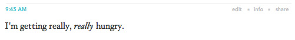
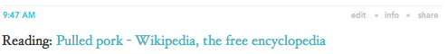
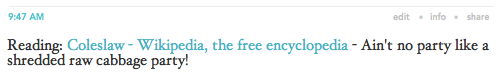
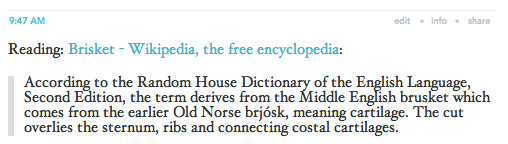

## Day One Alfred Tools

### What it needs

At this point, this Alfred Workflow requires:

* [The Day One CLI](http://dayoneapp.com/tools/)
* Brett Terpstra's `logtodayone.rb` script, found [here](http://brettterpstra.com/2012/01/16/logging-with-day-one-geek-style/)
* That you're using Safari

When you first import it, you will want to:

* Change the location of `logtodayone.rb` in the `log` script
* Change the location of `logtodayone.rb` in the `lw` script
* Change, if you'd like, the variables for formatting in the `lw` script
	* `prefix`: What comes before a link. Default is `Reading: `
	* `separator`: What separates a link and a comment. Default is ` - `. Change to "\n\n" if you would like the comment to be on a separate line.
	* `quoteSeparator`: What separates a link and a quote. Default is `:\n\n>`.

### What it does

* `log` logs to Day One. This can use the time and starring syntax outlined [here](http://brettterpstra.com/2012/01/16/logging-with-day-one-geek-style/).
	
* `lw` and `lw!`-- "log web" -- log the frontmost website and title as a link. `lw!` creates a starred entry.
	
* `lw comment` and `lw! comment` do the same, but with a comment.
	
* `lwq` and `lwq!` create an entry with a link and the text on the clipboard as a quote. 
	

**Errors**: Everything worked out unless

* You got a notification with just a title and no text.
* You got a notification with a title and an error.
* You didn't get a notification.

### What it doesn't do yet

Eventually, I'd like to:

* Combine the scripts.
* Catch errors when the script can't get to safari. Currently, a notification appears with just a header and no error.
* Add a version for Chrome and Firefox. Not sure if this is possible at the moment.
* Create an easier way to change the location of `logtodayone.rb` in each of the scripts, preferably through Alfred itself.
* Incorporate Terpstra's time functions in the web-logging commands.
* Add more commands. Ideas are very welcome.

[Here](http://www.alfredforum.com/topic/1436-day-one-tools-logging-and-logging-from-safari/) is my post about this workflow of the Alfred forum.

### What's changed

##### 2013-04-15b:

* Added a notification letting using know that the script ran successfully. Requested [here](http://www.alfredforum.com/topic/1436-day-one-tools-logging-and-logging-from-safari/?p=7315).

##### 2013-04-15a:

* Added `lwq` and `lwq!`, which add a link and any text in your clipboard as a quote.
* Added an easier way to change the text separating the link and comment. Requested [here](http://www.alfredforum.com/topic/1436-day-one-tools-logging-and-logging-from-safari/?p=7584).
* Added images to the readme.